# Level-up CSP Technical Training – Power Platform Facilitator Guide

## Build a copilot for your customer’s webpage

## Lab Guide for Retail Scenario

| Description | Develop a Virtual Assistant copilot for Contoso Electronics' website to enhance customer support by simplifying the laptop discovery process, providing tailored recommendations, and offering side-by-side device comparisons. The copilot will also inform customers about current deals, accessories, and protection plans. Additionally, it will assist with appointment scheduling for further consultation with sales associates. To streamline the post-purchase process, the copilot will provide information on Contoso’s return policies, check return eligibility, and enable customers to submit refund requests directly within the chat interface for a seamless user experience. |
|:---|----|
| Prerequisites | To get the most out of this lab guide we recommend you have Work, School or Admin Tenant ID and Password. Trial access with Power Apps, Power Automate Flow, Copilot Studio, Dynamic 365 Customer Service and Return policy lab file. |
| Duration | 2 hours |
| Version | 1.0 |
| Publication date  | September 2024 |

This document is provided “as-is”. Information and views expressed in
this document, including URL and other Internet Web site references, may
change without notice. You bear the risk of using it. 

This document does not provide you with any legal rights to any
intellectual property in any Microsoft product. You may copy and use
this document for your internal reference purposes. 

 

© 2024 Microsoft. All rights reserved.  

# **Objective & Scenario**

## Objective

Develop a standalone Virtual Assistant copilot for Contoso Electronics'
webpage to assist customers in discovering the best products based on
their specific needs and preferences, as well as handling post-purchase
activities like verifying return eligibility and submitting refund
requests seamlessly.

## Solution Focus Area

Contoso Electronics, a leader in consumer electronics, offers a wide
variety of devices and accessories, making it challenging for customers
to find the right product that meets their unique requirements and book
appointment for sales assistance. In addition, customers may need
assistance with returns and refunds for products that do not meet their
expectations.

Currently, customers face two main challenges:

1.  **Product Discovery:** Customers struggle with exploring the vast
    array of options, comparing specifications, and understanding
    promotions and deals, which delays purchasing decisions and book
    appointment for further sales assistance.

2.  **Return Process:** Customers experience difficulties in navigating
    Contoso’s return policies and efficiently submitting refund
    requests.

To enhance customer satisfaction and streamline both the discovery and
post-purchase processes, Contoso Electronics will deploy a Virtual
Assistant copilot on its website. This AI-powered assistant, enhanced
with knowledge sources, will assist customers from the initial product
discovery phase through to post-purchase services like returns and
refunds.

## Persona and Scenario

- **Remy Morris** - Digital Solutions Architect 

<!-- -->

- **Mark Brown** – Project lead 

<!-- -->

- **David Flores** – App developer 

<!-- -->

- **Jane Miller** – App tester 

- **Grady Archie –** Customer (Product Discovery)

- **Miriam Graham –** Customer (Refund Request)

These personas will participate in the following sequential scenarios: 

- Remy Morris, Digital Solutions Architect at Contoso Electronics,
  creates and plans digital architecture that aligns with the business
  need and articulates this framework to Mark Brown, the Project Lead at
  Contoso Electronics, and assists him in selecting the most suitable
  Power Platform tools for the implementation of the digital solutions. 

<!-- -->

- Mark Brown provides David Flores with an overview of the tools and
  processes involved in developing a virtual agent with copilot studio
  and power apps and creating a booking appointment and refund request
  flow using Power Automate. 

<!-- -->

- David successfully creates a virtual assistant, fulfilling all the
  requirements of Contoso electronics to provide virtual assistance for
  product information, booking assistance appointment and submit refund
  requests, which he then submits to Jane Miller for testing. 

<!-- -->

- After thorough testing and validation, Mark Brown officially deployed
  a virtual agent on Contoso electronics website for virtual assistance
  to the customer and streamline the refund or return process.

- Grady Archie, a returning student, visits the Contoso Electronics
  website to find a laptop for his studies, gaming, and video editing.
  He engages with the Virtual Assistant copilot and outlines his
  specific needs, including battery life, durability, and performance.
  The copilot provides him with recommendations, compares specs,
  highlights current deals on Microsoft Surface laptops, and suggests
  compatible accessories. Grady decides to purchase the Surface Laptop
  Studio 2 but opts to schedule an appointment with a sales associate
  through the copilot to finalize his decision.

- Miriam Graham, a frequent shopper, wants to return a laptop due to
  unsatisfactory battery life. She interacts with the Virtual Assistant
  copilot to check if she is eligible for a return. The copilot quickly
  accesses Contoso’s return policies and confirms her eligibility.
  Miriam then asks the copilot to assist with submitting a refund
  request. The copilot guides her through the form submission process,
  enabling her to complete the refund request within the chat window.

## Pre-requisites 

For this use case, all participants will need the following: 

- Work, School or Admin Tenant Email Id and Password.

- Microsoft Power Apps Free Trial License

- Microsoft Power Automate Free Trial License

- Microsoft Copilot Studio Free Trial License

- Microsoft Dynamic 365 Customer Service Free Trial License

- Contoso Refund Policy File.

**Note:** Please be aware that the user interface (UI) of Power Apps,
Copilot, Microsoft 365, Power Automate, and other related tools may
change over time as Microsoft continues to update its products. However,
the core concepts and logic behind their functionality will remain
consistent. The principles you learn in this lab can still be applied,
even if the UI looks different in the future.

# **Lab Instructions**

# Exercise 1: Setting Up and Configuring Dynamic 365 Customer Service

In this exercise, you'll set up and configure Dynamics 365 Customer
Service by signing up for a trial, managing users, and configuring
essential settings. Follow these steps to get hands-on with the
platform's core features and start optimizing your customer service
operations.

## Task 1: Sign Up for Dynamics 365 Customer Service Trial

1.  Begin by opening your preferred web browser and navigating to the
    <https://www.microsoft.com/en-us/dynamics-365/products/customer-service>
    page.

2.  On the homepage, locate and click on the **Try for free** button.
    This will initiate the process to sign up for a free trial of
    Dynamics 365 Customer Service, allowing you to explore its features
    and capabilities.

3.  After clicking the button, you will be redirected to a page where
    you need to enter your Work, School or Admin Tenant Email ID. For
    this lab, we use an admin tenant ID, but participants can use any of
    these options.

**Note:** If your work, school, or admin tenant email ID works fine, you
can use it to sign in without any issues. However, if you're
experiencing problems with your current ID or if you don't have a work,
school, or admin tenant ID, you will need to create one. To do so, use
the following link to set up a new ID: [Create New
ID](https://go.microsoft.com/fwlink/?LinkId=2139833&ru=https%3A%2F%2Fwww.microsoft.com%2Fen-us%2Fdynamics-365%2Fproducts%2Fcustomer-service%3Ftsapp%3Dcustomerservice%26trialflow%3Dadmin&email=bumblebee.code%40outlook.com).
This will allow you to complete the registration and resolve any sign-in
issues.

4.  Once you have entered the ID**,** Select the checkbox and click on
    **Start your free trial** to proceed.

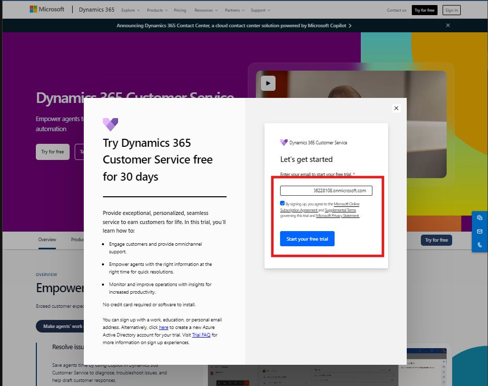

5.  Then Enter the **password** required for the login and then click on
    **Sign in.**

6.  On the next screen, you will be asked to provide additional details
    to complete the setup. Select **Country (We choose United States)**
    as **region**.

7.  Enter your **Phone Number** in the provided field for verification
    purposes. This helps Microsoft ensure that the trial is being
    accessed by genuine users.

8.  Once all information is entered, Select the cleck box and click on
    **Submit** to finalize the setup.

9.  After successfully submitting your information, the system will
    automatically redirect you to the **Dynamics 365 Customer Service**
    workspace.

10. This workspace serves as the central hub where you can access
    various customer service tools and functionalities within Dynamics
    365.

11. Within the workspace, you'll find several applications that are
    crucial for managing customer service operations. Turn of the new
    look and click on **Customer Service workspace** to open and explore
    these apps.

12. Next, locate and click on the **Customer Service admin Center**
    within the workspace. The admin centre is where you can configure
    settings, manage users, and customize various aspects of your
    customer service setup.

13. In the admin Center, go to the **Customer Support** group and select
    **Routing**. This section allows you to manage how customer service
    requests are routed to the appropriate channels or agents within
    your organization.

Note: If participants are using school or work email ID, no need to
perform this step.

**Screenshot: Admin Tenant ID**

14. On the Routing page, scroll down to locate the Record Routing
    section. Here, you will find an option labelled **Turn on Unified
    Routing for Records**. Click **Manage** next to this option to open
    the settings.

Note: If participants are using school or work email ID, no need to
perform this step.  
  
**Sceenshort: Admin Tenant ID**

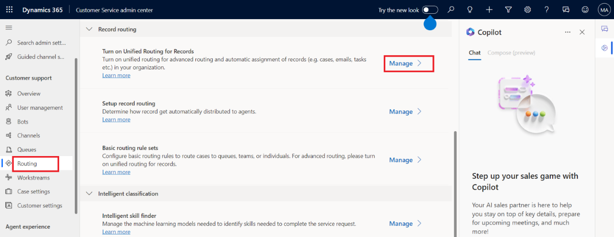

15. You will be taken to the Service Configuration Settings page. Under
    the Unified Routing section, ensure that the Turn on Unified Routing
    toggle is switched to Yes. If it is not set to Yes, please turn it
    on.

Note: If participants are using a school or work email ID, this step are
not necessary.

> **Sceenshort: Admin Tenant ID**
>
>  style="width:6.26806in;height:2.76181in" />

16. Finally, click **Save** to apply the configuration changes. If
    participants are using a school or work email ID, these steps are
    not necessary.

## Task 2: Manage a User in Omnichannel for Customer Service

1.  Start by accessing the **Dynamics 365 Customer Service admin
    center**.

2.  In the site map on the left, locate and select **User management**
    under the **Customer support group**.

3.  On the **User management** page, find the **Users** section.

4.  Click on the **Manage** button next to **Users** to open the list of
    users within your organization.

5.  To focus on users who are part of the Omnichannel for Customer
    Service, click the dropdown next to **Enabled Users**.

6.  From the dropdown menu, select **Omnichannel Users**. This filters
    the list to show only those users who are active in the Omnichannel
    environment.

7.  Click on the Omnichannel username to open the specific settings and
    configurations for that user. In our admin tenant, the **username**
    is displayed as **MOD Administrator**. If participants are using
    their work, School or Tenant ID, their username may be change and
    shows **like “John”, "Admin" etc.**  
      
    

8.  Once you are on the user page, locate and select the **Omnichannel**
    tab. This tab contains settings specific to Omnichannel
    functionality, allowing you to manage how the user interacts within
    the Omnichannel environment.

9.  On the Omnichannel tab, you will confirm the following settings. If
    the current setting differs, please adjust the value as indicated
    below:

    1.  Capacity: Set the value to 100. This defines the user's workload
        capacity within the Omnichannel environment.

    2.  Default Presence: Set this to Available. This specifies the
        user's default status when logged into the Omnichannel system.

>  style="width:6.26806in;height:2.57014in"
> alt="A screenshot of a computer Description automatically generated" />

10. Click on **Save and close** to finalize the user settings and exit
    the configuration page.

>  style="width:6.26806in;height:2.55417in"
> alt="A screenshot of a computer Description automatically generated" />

## Task 3: Configure Omnichannel Power Virtual Agent Extension

1.  Start by navigating to the
    <https://appsource.microsoft.com/en-cy/product/dynamics-365/mscrm.omnichannelpvaextension?tab=Overview&ref=dynamicsforcrm.com>
    page. If required, sign in with **same ID and password** which used
    in Dynamic 365 Customer Service.

2.  On this page, click the **Get it now** button. This initiates the
    installation of the extension, which is essential for integrating
    Power Virtual Agents into your Omnichannel setup.

3.  After clicking **"Get it now,"** you'll be prompted to select an
    environment where the extension will be installed.

4.  Choose Environment **CustomerService Trial** from the dropdown menu,
    select both checkboxes then click **Install.**
    

5.  Once the extension is installed, Dynamic 365 apps page will open,
    you’ll need to update all Dynamics 365 apps to ensure they are
    compatible with the new extension. Look for any app that have an
    **Update available** status and click on the **update available.**

6.  For each app with an update available, select the checkbox to agree
    to the terms, then click **Update**. This step is crucial to ensure
    all components work together seamlessly.

>  style="width:4.81667in;height:5.03333in"
> alt="A screenshot of a computer Description automatically generated" />

## Task 4: Configure Search Settings in the Power Platform Admin Center

1.  First, log in to the <https://admin.powerplatform.microsoft.com/>
    using same credentials.

2.  After logging in, navigate to **Environments** on the left-hand side
    and select **CustomerService Trial** environment from the list.

3.  In the CustomerService Trial environment, locate the top pane, click
    the dropdown next to **Resource**, and select **Dynamics 365 apps**.

4.  Ensure that **Omnichannel for Customer Service** is installed. This
    confirms that the Omnichannel features are active in your
    **CustomerService Trial** environment, enabling you to configure the
    necessary settings.

5.  Go back to the **Environments -\> CustomerService Trial** page in
    the admin center.

6.  Click on **Settings** in the top pane, which will bring up various
    configuration options.

7.  Under **Product**, select **Features**. This section allows you to
    enable or disable specific features related to search functionality.

8.  In the **Features** section, you’ll find several options related to
    search. You’ll need to toggle the following settings to **ON**:

    1.  **Dataverse Search**: This feature enhances the overall search
        capability, making it easier to find records across the
        Dataverse.

    2.  **Single Table Search**: This allows you to perform searches
        within a specific table, which can improve the accuracy of
        search results.

9.  After toggling the search settings to **ON**, scroll down to the
    bottom of the page.

10. Click the **Save** button located at the bottom right to apply the
    changes. This step ensures that your configurations are active and
    ready for use in your environment.

## Conclusion

After completing this exercise, you have gained the following knowledge:

1.  Set up and configured **Dynamics 365 Customer Service** with Unified
    Routing.

2.  Managed users in **Omnichannel**, optimizing their capacity and
    availability.

3.  Installed and configured the **Power Virtual Agent Extension** for
    enhanced customer interactions.

4.  Enabled advanced **search features** in the Power Platform,
    improving data accessibility and search accuracy.

This ensures a fully functional customer service environment with
streamlined operations.

# Exercise 2: Signup for Power Apps and Copilot Studio

In this exercise, we will focus on signing up for Microsoft Power Apps
and Copilot Studio. This process will enable you to access and leverage
these platforms for developing and integrating automated solutions. You
will begin by creating your accounts and setting up the necessary
environments to start building and configuring your applications and
Copilot functionalities.

## Task 1: Sign Up for Microsoft Power Apps

1.  Open your web browser and go to the
    <https://powerapps.microsoft.com/free/> page.

2.  On this page, locate the **Try free** button and click on it to
    begin the sign-up process.

3.  Under the "Let's get started" section, you'll see a text box
    labelled **Enter your work or school email to get started**. Type in
    your same ID here which we use in **Dynamic 365 Customer Service.**

4.  After entering your **ID**, check the agreement box to agree to the
    terms and conditions.

5.  Click on **Start free** to proceed.

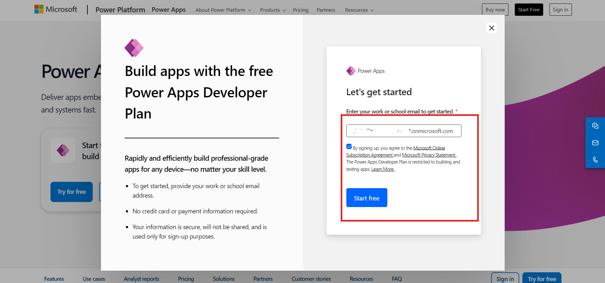

6.  If you receive a prompt stating that you already have a Microsoft
    account associated with the entered email address, select **Sign
    in**. Enter your same **ID and Password** when prompted.

7.  After signing in, you may be prompted with an option to stay signed
    in. Select **Yes** to stay signed in for quicker access in the
    future.

8.  Once you're signed in, look at the top-right corner of the screen.
    Choose the environment **CustomerService Tria**l. This is important
    for the next steps, as you’ll need to select this environment when
    working in Power Apps.

## Task 2: Sign up for Copilot Studio

1.  Navigate
    to [https://copilotstudio.microsoft.com](https://copilotstudio.microsoft.com/) and
    click on **sign in.**

2.  Pick an account window will pop up, select your same account. If
    prompted to sign in, enter your same ID and Password which we use in
    power apps, then select Sign in.

>  style="width:6.26806in;height:2.83958in" />

3.  In the **Welcome to Copilot Studio** popup, leave the country/region
    as the default value and select get started.

>  style="width:6.26806in;height:2.96389in" />

4.  At the Welcome to Copilot Studio! popup, select Skip.

5.  At the top right of the screen, select **CustomerService Trial**
    environment from the previous step.

## 

## Conclusion

After completing this exercise, you have gained the following knowledge:

1.  Signed up for **Microsoft Power Apps** and selected the **Customer
    Service environment**.

2.  Registered for **Copilot Studio**, linking it to your environment
    for building AI-driven solutions.

This prepares you for creating and managing apps with enhanced customer
service features.

# Exercise 3: Create Custom Tables

In this exercise, you'll create custom tables in Power Apps to manage
data efficiently. You'll start by setting up a solution and assigning it
as your preferred solution. Then, you'll create and configure two
tables: "Book Appointments" and "Refund Requests," adding relevant
columns to capture all necessary information. Follow these steps to
build and organize your data tables effectively.

## Task 1: Create a Solution in Power Apps

1.  Navigate to the Power Apps Maker Portal at
    <https://make.powerapps.com> using your web browser.

2.  Ensure you are signed in with the same credentials and select the
    **CustomerService Trial** environment from the top-right corner.

3.  On the top right-hand side, turn **off** the **“Try the new data
    experience”.**

4.  In the left-hand navigation pane, find and select **Solutions**.

5.  Once in the Solutions section, click on **+ New solution** to create
    a new solution.

6.  In the **New solution** form, enter **Contoso Electronics** as the
    Display Name for your solution. This name identifies your solution
    within the environment.

7.  Next, you need to assign a publisher to your solution. Click on **+
    New publisher** to create a new one.

8.  Fill in the following details in the publisher form:

    1.  **Display name**: Contoso

    2.  **Name**: contoso

    3.  **Prefix**: contoso

9.  After entering these details, click **Save**.

10. Once the publisher is created, select **Contoso (contoso)** from the
    Publisher dropdown.

11. Click on **Create** to finalize your new solution.

>  style="width:6.26806in;height:3.00972in" />

12. After creating your solution, click on **Back** in the left corner
    of the screen. This takes you back to the main Solutions page, where
    you can see your newly created solution listed.

## Task 2: Set the Preferred Solution

1.  In the Power Apps Maker portal, navigate to the **Solutions**
    section in the left-hand menu.

2.  Locate the option **Manage** under **Current preferred solution**
    and click on it.

3.  A list of available solutions will be displayed. Find and select
    **Contoso Electronic (contoso)** from the list.

4.  Once selected, click on **Apply** to set this solution as your
    preferred choice.

## Task 3: Create the "Book Appointments" Table

1.  In the Power Apps Maker portal, select **Tables** from the left-hand
    navigation pane.

2.  Click on **+ New table**, and then choose **Add columns and data**
    to start creating your new table.

3.  By default, the new table will be named "New Table." Click the edit
    button next to table name and rename it to **Book Appointments** and
    click on **Save** button.

4.  **Appointment Type Column:**

    1.  Click on the down arrow next to the first column, and then
        select the edit column button.

>  style="width:5.875in;height:2.77933in" />

2.  Change the display name to **Appointment Type** and click on
    **Save**.

>  style="width:5.93056in;height:2.82007in" />

5.  **Full Name Column:**

    1.  Click on the **+ (add column)** button, change the display name
        to **Full Name**, and save the column.

6.  **Email Address Column:**

    1.  Click on the **+ (add column)** button, change the display name
        to **Email Address**, and save.

7.  **Phone Number Column:**

    1.  Click on the **+ (add column)** button, change the display name
        to **Phone Number**, and save.

>  style="width:6.02778in;height:2.85027in" />

8.  **Date Column:**

    1.  Click on the **+ (add column)** button, change the display name
        to **Date**, and save.

>  style="width:6.0919in;height:2.88194in" />

9.  **Time Column:**

    1.  Click on the **+ (add column)** button, change the display name
        to **Time**, and save.

>  style="width:6.00586in;height:2.86319in" />

10. After adding all the necessary columns, click on the **Create**
    button to finalize and create the **"Book Appointments"** table.

>  style="width:6.26806in;height:2.99514in" />

## Task 4: Create the "Refund Requests" Table

1.  In the Power Apps Maker portal, select **Tables** from the left-hand
    navigation pane.

>  style="width:6.26806in;height:2.96736in" />

2.  Click on **+ New table**, and then choose **Add columns and data**
    to start creating your new table.

3.  By default, the new table will be named **"New Table."** Click the
    edit button next to new table rename it to **Refund Requests** and
    click on **Save** button.

4.  **Full Name Column:**

    1.  Click on the down arrow next to the first column, and then
        select the edit column button.

> 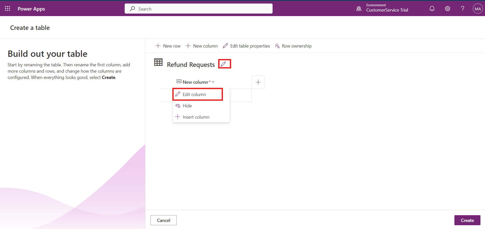 style="width:6.13647in;height:2.91458in" />

2.  Change the display name to **Full Name** and click on **Save**.

>  style="width:6.11806in;height:2.89906in" />

5.  **Date of Purchase Column:**

    1.  Click on the **+ (add column)** button, change the display name
        to **Date of Purchase**, and save.

>  style="width:6.10417in;height:2.88775in" />

6.  **Description Column:**

    1.  Click on the **+ (add column)** button, change the display name
        to **Description**, and save.

>  style="width:6.13889in;height:2.90145in" />

7.  **Email Column:**

    1.  Click on the **+ (add column)** button, change the display name
        to **Email**, and save.

>  style="width:6.17361in;height:2.92402in" />

8.  **Order Number Column:**

    1.  Click on the **+ (add column)** button, change the display name
        to **Order Number**, and save.

>  style="width:6.15972in;height:2.92222in" />

9.  **Order Type Column:**

    1.  Click on the **+ (add column)** button, change the display name
        to **Order Type**, and save.

>  style="width:6.13889in;height:2.91369in" />

10. **Phone Number Column:**

    1.  Click on the **+ (add column)** button, change the display name
        to **Phone Number**, and save.

>  style="width:6.09028in;height:2.87645in" />

11. **Preferred Contact Method Column:**

    1.  Click on the **+ (add column)** button, change the display name
        to **Preferred Contact Method**, and save.

12. **Product Column:**

    1.  Click on the **+ (add column)** button, change the display name
        to **Product**, and save.

>  style="width:6.125in;height:2.88064in" />

13. **Receipt Number Column:**

    1.  Click on the **+ (add column)** button, change the display name
        to **Receipt Number**, and save.

14. After adding all the necessary columns, click on the **Create**
    button to finalize and create the **"Refund Requests"** table.

>  style="width:6.26806in;height:3.00833in" />

## Conclusion

After completing this exercise, you have gained the following knowledge:

1.  Created a **solution** called "Contoso Electronics" in Power Apps.

2.  Set it as your **preferred solution**.

3.  Built two custom tables, **Book Appointments** and **Refund
    Requests**, each with relevant columns to manage customer data
    effectively.

This setup helps organize and structure essential customer service
information in your environment.

# Exercise 4: Build a Copilot in Microsoft Copilot Studio with New AI Capabilities

In this exercise, you will create and configure a new copilot in
Microsoft Copilot Studio to assist with Contoso Electronics services.
You’ll start by setting up the copilot, including naming it and defining
its role. Next, you'll configure security settings and enable generative
AI features. You will then clean up sample and system topics, create a
knowledge base with relevant information, and finally publish your
copilot to make it operational. Follow these tasks to set up a fully
functional and intelligent copilot for your organization.

## Task 1: Create Contoso Electronics Services Copilot

1.  Navigate to Microsoft copilot studio and sign in with same id and
    password.

2.  Once logged in, make sure you are in the right environment. if not,
    please select the right environment (CustomerService Trial)

3.  On the left navigation pane, find and click on **Create**. Then,
    select the **New Copilot** tile to begin the setup process.

**Note:** The **Create a Copilot** wizard will open. This wizard guides
you through the process of setting up your copilot by allowing you to
name it, choose the language, and optionally enable generative answers
to enhance conversations.

>  style="width:6.26806in;height:2.99028in" />

4.  When prompted, select **Skip to configure** to proceed without
    additional configuration options at this stage.

5.  In the **Name** text box, type **Contoso Electronics Services**.
    This will be the name of your new copilot.

6.  In the **Description** text box, enter **“Provide information about
    laptops, refund policy, and facilitate bookings or appointments.”**
    This description helps define the copilot’s role and functionality.

7.  In the **Instructions** text box, type “**Create a copilot for
    topics related to providing laptop information, processing refund
    requests, and booking appointments with sales executives or for
    product returns.”** This guides the copilot in handling specific
    tasks and user interactions.

8.  Choose **English** from the language options. This will set the
    primary language for interactions with the copilot.

9.  Click on the three dots next to the **Create** button in the
    top-right corner of the screen. Select **Edit advanced settings**
    from the dropdown menu.

10. In the advanced settings, find and select **Contoso Electronics**
    within the solution dropdown option. Click on **Save** to apply the
    advanced settings and proceed.

11. Finally, in the top-right corner of the screen, click on **Create**
    to finalize and deploy your new copilot.

## Task 2: Configure Security and Generative AI

1.  In Microsoft Copilot Studio, locate and click on the **Settings**
    option in the top-right corner of the screen. This action will open
    the settings menu.

2.  Within the settings menu, select the **Security** tab. This tab is
    specifically for configuring security options for your copilot.

3.  In the Security settings, find and select the **Authentication**
    tile. This section allows you to determine how users will
    authenticate to interact with your copilot.

4.  Choose **No authentication** from the available options. This
    setting will allow unrestricted access to your copilot without
    requiring users to log in.

5.  Click **Save** to apply the authentication settings.

6.  To ensure your changes have been saved, click **Save** again if
    prompted by the system.

7.  On the left-hand side, above the Security tab, select **Generative
    AI**.

8.  For **“How should your copilot interact with people?”**, select
    **Generative AI** to **enable** this feature.

9.  For **“How strict should the content moderation be?”**, choose
    **Medium**. This setting balances content moderation with
    flexibility.

10. Click **Save** to apply these settings.

11. After saving your settings, click **Close** to exit the settings
    window.

12. In the Copilot pane on the left-hand side of the screen, select your
    copilot to return to the **Overview** tab. This will take you back
    to the main dashboard where you can manage your copilot.

## Task 3: Delete Sample Topics

1.  In Microsoft Copilot Studio, navigate to the **Topics** tab. This
    section allows you to manage the topics associated with your
    copilot.

2.  Select the **Custom** tab to view the sample topics that were
    included with the new copilot.

3.  Locate the topic titled **Lesson 1**. Click on the three dots
    (ellipsis) next to this topic to reveal more options.

4.  Select **Delete** from the options.

5.  Confirm the deletion by clicking **Delete** again in the
    confirmation dialog.

6.  Follow the same steps to delete **Lesson 2** and **Lesson 3**.
    Ensure each deletion is confirmed as done in the previous step.

## Task 4: Disable System Topics

1.  In Microsoft Copilot Studio, navigate to the **Topics** tab.

2.  After removing the sample topics, select the **All** tab to view
    both custom and system topics.

3.  Find the **Sign in** topic from the list of system topics.

4.  Toggle the switch under the **Enabled** column to **Off** to disable
    this topic.

>  style="width:6.26806in;height:2.99306in" />

## Task 5: Create Knowledge Base for Copilot

1.  Open Microsoft Copilot Studio and go to the **Overview** tab.

2.  Scroll down and **Disable** Allow the AI to use its own general
    knowledge (preview).

3.  Navigate to the **Knowledge** section next to overview option and
    click on it.

4.  Click on the **+ Add Knowledge** button to begin adding new
    knowledge sources.

5.  To add knowledge about products or laptops, select the **Public
    Website** option.

6.  Enter the URL <https://support.microsoft.com/en-us/surface> in the
    link section. This URL leads to Microsoft's support page for Surface
    products, which will serve as a knowledge source.

7.  Click **Add** next to the link to include it in the knowledge base.

8.  Then, click **Add** at the bottom of the section to finalize adding
    this knowledge source.

9.  Return to the **Copilot Window** **Knowledge section**, click on **+
    Add Knowledge**, and select the **File** option.

10. Click on the **Browse** button to locate and select the **Refund
    Policy** lab file.

11. Click **Add** to include this file as part of the copilot’s
    knowledge base.

## Task 6: Publish Your Copilot

1.  Navigate to Overview section and In Microsoft Copilot Studio, look
    for the **Publish** button on the right side of the screen.

2.  Click on the **Publish** button to start the publishing process.

3.  A confirmation dialog may appear. Select **Publish** again to
    finalize and publish your copilot.

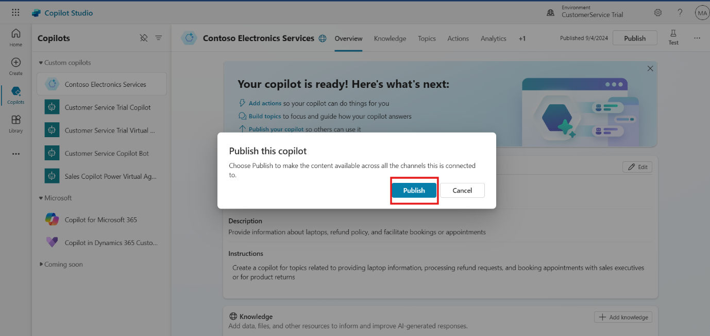

## Conclusion

After completing this exercise, you have gained the following knowledge:

1.  Created and named a **Contoso Electronics Services Copilot**.

2.  Configured **security settings** and enabled **generative AI**.

3.  Cleaned up unnecessary sample and system topics.

4.  Created a **knowledge base** by adding relevant product and refund
    policy information.

5.  Published a fully operational **copilot** to assist with customer
    inquiries and services for Contoso Electronics.

This copilot will streamline customer interactions by providing
information about laptops, refund policies, and facilitating bookings or
appointments

# Exercise 5: Create and Manage Topics

In this exercise, you will learn how to create and manage topics within
the Copilot Studio. Topics are essential for defining how your copilot
interacts with users, responding to specific triggers, and providing
relevant information. You will create various topics such as "Product
Information," "Return Policy Information," "Compare Laptop," "Book
Appointments," and "Refund Requests." Additionally, you'll configure the
Conversation Start topic and adjust settings in the Conversational
Boosting and System Fallback topics to enhance the overall functionality
of your copilot. This exercise will help you set up and fine-tune your
copilot's ability to handle diverse customer inquiries and interactions
effectively.

## Task 1: Create a Topic "Product Information"

1.  Open Copilot Studio and select the copilot you've created for this
    project.

2.  In the top bar, select **Topics** which is located next to
    **Knowledge**.

3.  Click on **+ Add a topic** to create a new topic. Choose **From
    blank** to start with a blank template.

4.  In the new topic canvas, at the top of the screen, enter the name of
    the topic **"Product Information"**.

5.  In the canvas, you'll see a **Trigger node**. In the **Describe**
    section, enter the following phrases to trigger this topic:

**What are some deals on student laptops right now, Student laptop
deals, laptop deals, laptop information, laptop detail, laptop feature,
laptop specification**

6.  Below the Trigger node, click on the **+** sign to create a new
    node. Select **Advanced options**, then choose **Generative
    Answer**. A Generative Answer node will be created.

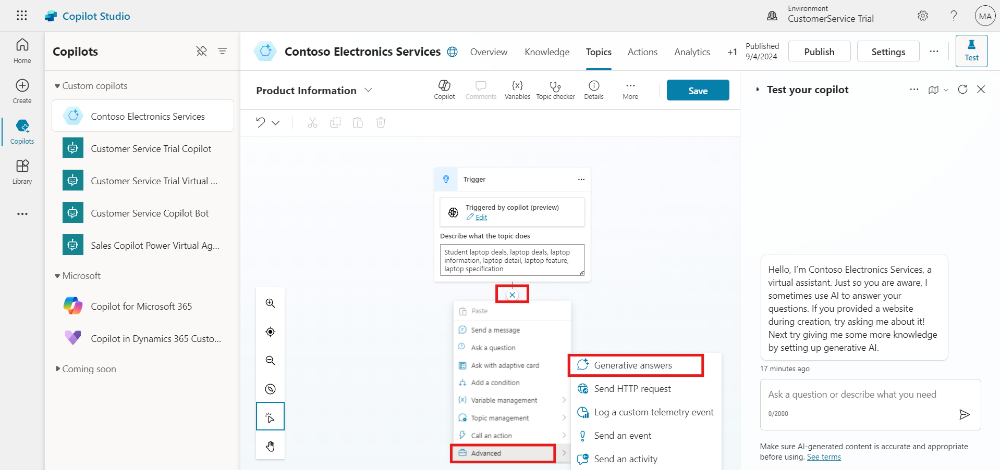

7.  In the Generative Answer node, click on the **Input** option
    variable window will open.

8.  In the **Select a variable** window, select **System** and scroll
    down to choose **Activity.Text**.

9.  In the Generative Answer node, click on the **Edit** option in the
    **Data Source** section.

10. Enable the option **Search only selected sources**.

11. Choose the **Microsoft website** from the options displayed and
    scroll down.

12. In the **Content Moderation** section, select **Medium**.

13. Scroll up and click on the **(X)** to close Create generative answer
    properties window.

14. Click on the **Save** button to save your configurations for the
    **"Product Information"** topic.

## Task 2: Create a Topic "Return Policy Information"

1.  Open Copilot Studio and select the copilot you've created for this
    project.

2.  In the top bar, select **Topics** which is located next to
    **Knowledge**.

3.  Click on **+ Add a topic** to create a new topic. Choose **From
    blank** to start with a blank template.

4.  In the new topic canvas, at the top of the screen, enter the name of
    the topic **"Return Policy Information"**.

5.  In the canvas, you'll see a **Trigger node**. In the **Describe**
    section, enter the following phrases to trigger this topic:

**return policy, can I return a product?, what is your return policy?,
how do I return an item?, returning a purchase, information about return
policy,**

6.  Below the Trigger node, click on the **+** sign to create a new
    node. Select **Advanced options**, then choose **Generative
    Answer**. A Generative Answer node will be created.

7.  In the Generative Answer node, click on the **Input** option
    variable window will open.

8.  In the variable window, select **System** and scroll down to choose
    **Activity.Text**.

9.  In the Generative Answer node, click on the **Edit** option in the
    **Data Source** section.

10. Enable the option **Search only selected sources**.

11. Choose the **Return Policy** Doc from the options displayed and
    scroll down.

12. In the **Content Moderation** section, select **Medium**.

13. Scroll up and click on the **(X)** to close Create generative answer
    properties window.

14. Click on the **Save** button to save your configurations for the
    **"Refund Policy Information"** topic.

## Task 3: Create a Topic “Compare laptop”

1.  Open Copilot Studio and select the copilot you've created for this
    project.

2.  In the top bar, select **Topics** which is located next to
    **Knowledge**.

3.  Click on **+ Add a topic** to create a new topic. Choose **From
    blank** to start with a blank template.

4.  In the new topic canvas, at the top of the screen, enter the name of
    the topic **"Compare laptop"**.

5.  In the canvas, you'll see a **Trigger node**. In the **Describe**
    section, enter the following phrases to trigger this topic:

> **compare laptop, compare product, laptop comparison, compare between
> laptops**

6.  Below the Trigger node, click on the **+** sign to create a new
    node. Select **Advanced options**, then choose **Generative
    Answer**. A Generative Answer node will be created.

7.  In the Generative Answer node, click on the **Input** option
    variable window will open.

8.  In the variable window, select **System** and scroll down to choose
    **Activity.Text**.

9.  In the Generative Answer node, click on the **Edit** option in the
    **Data Source** section.

10. Enable the option **Search only selected sources**.

11. Choose the **Microsoft website** from the options displayed and
    scroll down.

12. In the **Content Moderation** section, select **Medium**.

13. Scroll up and click on the **(X)** to close Create generative answer
    properties window.

14. Click on the **Save** button to save your configurations for the
    **"Compare Laptop"** topic.

>  style="width:6.26806in;height:2.97708in" />

## Task 4: Create a Topic "Book Appointments"

1.  Open **Copilot Studio** and select the copilot you've created for
    this project.

2.  In the top bar, select **Topics** which is located next to
    **Knowledge**.

3.  Click on **+ Add a topic** to create a new topic. Choose **From
    blank** to start with a blank template.

4.  In the new topic canvas, at the top of the screen, enter the name
    **"Book Appointments"**.

5.  In the canvas, you'll see a **Trigger node**. In the **Describe**
    section, enter the following phrases to trigger this topic:

**book an appointment, schedule a meeting, make a reservation, set up an
appointment, arrange a consultation, virtual appointment, appointment,
schedule booking.**

6.  Below the Trigger node, click on the **+** sign to create a new
    node. Select **Send a Message Node,** a **Message Node** will be
    created. In the Message node, enter the following text:

**Thank you for choosing our virtual assistant for your laptop
consultation. We are here to help you. To book a virtual appointment,
simply complete the form below.**

7.  Below the Message node, click on the **+** sign to create a new
    node. Select **Ask with Adaptive Card**. An Adaptive Card Node will
    be created.

8.  In the Adaptive Card node, select the **three dots** (More Options)
    and then select **Properties**.

9.  In the Adaptive Card properties, below the **Edit JSON**. Paste the
    provided **JSON** code to create the adaptive card.

{

"\$schema": "<http://adaptivecards.io/schemas/adaptive-card.json>",

"type": "AdaptiveCard",

"version": "1.5",

"body": \[

{

"type": "TextBlock",

"text": "Virtual Assistant Booking",

"weight": "Bolder",

"size": "Large",

"horizontalAlignment": "Center"

},

{

"type": "Input.ChoiceSet",

"choices": \[

{

"title": "Virtual Showroom",

"value": "Virtual Showroom"

},

{

"title": "Customer Service",

"value": "Customer Service"

},

{

"title": "IT Support & Repair",

"value": "IT Support & Repair"

}

\],

"placeholder": "Placeholder text",

"id": "Appointmenttype",

"label": "Appointment Type",

"style": "expanded"

},

{

"type": "Input.Text",

"id": "fullName",

"placeholder": "Enter your full name",

"label": "Full Name",

"isRequired": true,

"errorMessage": "Full Name is required."

},

{

"type": "Input.Text",

"id": "contactPhone",

"placeholder": "Enter your phone number",

"label": "Phone Number",

"isRequired": true,

"errorMessage": "Phone Number is required."

},

{

"type": "Input.Text",

"id": "contactEmail",

"placeholder": "Enter your email address",

"label": "Email Address",

"isRequired": true,

"errorMessage": "Email Address is required.",

"style": "Email"

},

{

"type": "TextBlock",

"text": "Would you like to book a virtual appointment?",

"wrap": true,

"spacing": "Medium"

},

{

"type": "Input.Text",

"id": "appointmentDate",

"label": "Date",

"isRequired": true,

"errorMessage": "Date is required.",

"placeholder": "DD-MM-YYYY"

},

{

"type": "Input.ChoiceSet",

"choices": \[

{

"title": "12:00 PM",

"value": "12:00 PM"

},

{

"title": "01:00 PM",

"value": "01:00 PM"

},

{

"title": "02:00 PM",

"value": "02:00 PM"

},

{

"title": "03:00 PM",

"value": "03:00 PM"

},

{

"title": "04:00 PM",

"value": "04:00 PM"

},

{

"title": "05:00 PM",

"value": "05:00 PM"

}

\],

"placeholder": "Placeholder text",

"id": "appointmenttime",

"label": "Time",

"style": "expanded"

}

\],

"actions": \[

{

"type": "Action.Submit",

"title": "Book Appointments",

"data": {

"action": "bookAppointment"

}

}

\]

}

10. Select **Variables** to open the Variables pane.

11. Select all the boxes on the right-hand side for the topic variables.

12. Click on **Save** to save your configuration.

13. Below the Message node, click on the + **sign** to create a new
    node. Select **Ask a Question**. A **Question Node** will be
    created.

14. In question node select **Enter a Message** and enter the following
    text:

> Thank you, Full Name! Your Appointment Type appointment has been
> booked for Appointment Date at Appointment Time. Thank you for using
> our service.

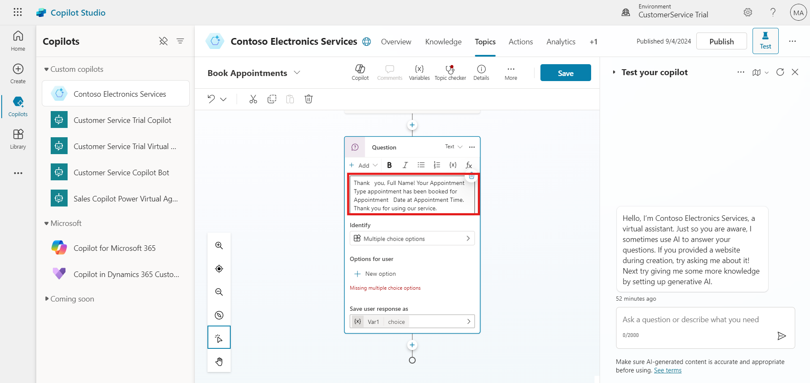

15. Replace the placeholders Full Name, Appointment Type, Appointment
    Date, and Appointment Time with the appropriate variables by
    clicking on the **{X}** icon and selecting the corresponding custom
    variables.

16. In the Question node, select **Multiple Choice** as the identify.

17. In the **Options for user** section, enter the following choices:

    1.  **Yes**

    2.  **No**

18. Below **Save the user's response** a new variable creates, click on
    the variable name variable properties window will open, where you
    can replace the variable name with **AfterAppointment**. Click the
    **(X)** to close the variable properties window.

19. Under the **Yes** condition, click on the **+** sign and select
    **Topic Management**, then choose **Go to Another Topic**. A topic
    selection window will open—search for **Conversation Start** and
    select the **Conversation Start** topic.

20. Under the **No** condition, click on the **+** sign and select
    **Send a Message**. A Message Node will be created. In the Message
    node, enter the following text:

> Thank you for using our service. Have a nice day.

21. Once all nodes are configured, click on **Save** to finalize and
    save your "**Book Appointments**" topic.

## Task 5: Create a Topic "Refund Requests"

1.  Open **Copilot Studio** and select the copilot you've created for
    this project.

2.  In the top bar, select **Topics** which is located next to
    **Knowledge**.

3.  Click on **+ Add a topic** to create a new topic. Choose **From
    blank** to start with a blank template.

4.  In the new topic canvas, at the top of the screen, enter the name
    **"Refund Requests"**.

5.  In the canvas, you'll see a **Trigger node**. In the **Describe**
    section, enter the following phrases to trigger this topic:

refund request, return request, return my product, want refund, want to
return

6.  Below the Trigger node, click on the **+** sign to create a new
    node. Select **Send a Message**. A **Message Node** will be created.
    In the Message node, enter the following text:

We are here to help you. To generate the refund or return request simply
complete the form below.

7.  Below the Message node, click on the **+** sign to create a new
    node. Select **Ask with Adaptive Card**. An Adaptive Card Node will
    be created.

8.  In the Adaptive Card node, select the **three dots** (More Options)
    and then select **Properties**.

9.  In the Adaptive Card properties, below the **Edit JSON** paste the
    provided JSON code to create the adaptive card.

{

"\$schema": "<http://adaptivecards.io/schemas/adaptive-card.json>",

"type": "AdaptiveCard",

"version": "1.4",

"body": \[

{

"type": "TextBlock",

"text": "Purchase Refund and Exchange Form",

"weight": "Bolder",

"size": "Large",

"horizontalAlignment": "Center"

},

{

"type": "Input.Text",

"id": "fullName",

"placeholder": "Enter your full name",

"label": "Full Name",

"isRequired": true,

"errorMessage": "Full Name is required."

},

{

"type": "Input.Text",

"id": "email",

"placeholder": "Enter your email address",

"label": "Email",

"style": "Email",

"isRequired": true,

"errorMessage": "Email is required."

},

{

"type": "Input.Text",

"id": "phoneNumber",

"placeholder": "Enter your phone number",

"label": "Phone Number",

"style": "Tel",

"isRequired": true,

"errorMessage": "Phone Number is required."

},

{

"type": "Input.Text",

"id": "product",

"placeholder": "Enter the product name or description",

"label": "Product",

"isRequired": true,

"errorMessage": "Product is required."

},

{

"type": "Input.ChoiceSet",

"id": "contactMethod",

"label": "Preferred Contact Method",

"style": "expanded",

"choices": \[

{

"title": "Phone",

"value": "Phone"

},

{

"title": "Email",

"value": "Email"

}

\],

"isRequired": true,

"errorMessage": "Preferred Contact Method is required."

},

{

"type": "Input.ChoiceSet",

"id": "orderType",

"label": "Order Type",

"style": "expanded",

"choices": \[

{

"title": "In Store",

"value": "In Store"

},

{

"title": "Online",

"value": "Online"

}

\],

"isRequired": true,

"errorMessage": "Order Type is required."

},

{

"type": "Input.Text",

"id": "receiptNumber",

"placeholder": "Enter the receipt number",

"label": "Receipt Number",

"isRequired": true,

"errorMessage": "Receipt Number is required."

},

{

"type": "Input.Text",

"id": "orderNumber",

"placeholder": "Enter the order number",

"label": "Order Number",

"isRequired": true,

"errorMessage": "Order Number is required."

},

{

"type": "Input.Text",

"placeholder": "Enter the Purchase Date",

"id": "purchaseDate",

"label": "Purchase Date",

"isRequired": true,

"errorMessage": "Purchase Date Required."

},

{

"type": "Input.Text",

"id": "description",

"placeholder": "Provide a brief description of the issue or reason for
return/exchange",

"label": "Description",

"isMultiline": true,

"isRequired": true,

"errorMessage": "Description is required."

}

\],

"actions": \[

{

"type": "Action.Submit",

"title": "Submit",

"data": {

"action": "submitRefundExchange"

}

}

\]

}

10. Select **Variables** to open the Variables pane.

11. Check the boxes on the right-hand side for the all-topic variables.

12. Click on **Save** to save your variable settings.

13. Below the adaptive card node, click on the + **sign** to create a
    new node. Select **Ask a Question, a Question Node** will be
    created.

14. In the Ask Question node message field, enter the message.

Thank you for using our service. You want to know more?

15. In the Question node, select **Multiple Choice** as the identify.

16. In the **Options for user** section, enter the following choices:

    1.  Shop

    2.  Deals and Promotion

    3.  IT Support and Device Repair

    4.  I’m done.

>  style="width:6.26806in;height:2.98194in" />

17. Below **Save the user's response** a new variable creates, click on
    the variable name variable properties window will open, where you
    can replace the variable name with **Afterrefund.**

18. Click the **(X)** to close the variable properties window.

19. Under the **Shop**, **Deals and Promotion and IT Support and Device
    Repair** condition, click on the **+** sign on each condition and
    select **Topic Management** for each, then choose **Go to Another
    Topic**. A topic selection window will open—search for
    **Conversation Start** and select the **Conversation Start** topic.

20. For **I’m done option,** click on the **+** sign and select **Topic
    Management** for each, then choose **Go to Another Topic** and
    select **End Conversation.**

21. Once all nodes are configured, click on **Save** to finalize and
    save your "Refund Requests" topic.

## Task 6: Configure the Conversation Start Topic

1.  Navigate to Copilot Studio and select the Copilot you've created for
    this project.

2.  In the top navigation bar, select **Topics**, which is located next
    to **Knowledge**.

3.  In the Topics section and select the **System** option to view the
    available system topics.

4.  Find and select the **Conversation Start** topic to open it.

5.  Below the **Trigger** node, a message node is available. Replace the
    message with the given below content.

Hello! I am Contoso Virtual Agent. How May I Help You?

6.  Click the **Save** button to save your configuration.

## Task 7: Configure the Conversational Boosting Topic

1.  Navigate to Copilot Studio and select the Copilot you've created for
    this project.

2.  In the top navigation bar, click on **Topics**, which is located
    next to **Knowledge**.

3.  In the Topics section, select the **System** option to view the
    available system topics.

4.  Find and select the **Conversational Boosting** topic to open it.

5.  In the **Generative Answer** node, click on Edit below the data
    source section.

6.  Toggle on the Search Only Selected Sources option.

7.  Select the **Microsoft Surface website** and the **Refund Policy**
    knowledge base as the sources for search from.

8.  Scroll down in the Generative Answer properties window.

9.  In the Content Moderation section, select the **Medium** option for
    content moderation.

10. Close the Generative Answer properties window once you're done.

11. Click on the **Save** button to save the configuration.

>  style="width:6.26806in;height:2.96528in" />

## Task 8: Use Generative Answers in the System Fallback Topic

1.  In the Copilot pane on the left-hand side of the screen, select the
    copilot you've created to return to the **Knowledge** tab.

2.  Select the Topics tab located at the top of the screen.

3.  Within the Topics tab, select the **System** option to view the
    available system topics.

4.  Find and select the **Fallback** topic to open it.

5.  In the **Fallback** topic, locate the existing message node.

6.  Click on the three dots (•••) in the top-right corner of the message
    node and select **Delete** to remove it.

7.  Below the Condition node, click on the + icon to add a new node.
    Select Advanced and then choose Generative answers from the options.

8.  In the Generative answers node, for the Input field, select
    **Activity.Text** from the system variables.

9.  Under the **Data sources** section, click on Edit.

10. Toggle on **Search only selected sources** to ensure that the AI
    pulls information only from specific knowledge sources.

11. From the list of available sources, select the **Microsoft Surface
    website** and **Refund Policy Doc** as the knowledge source.

12. Deselect the option **Allow the AI to use its own general
    knowledge** to ensure the AI only uses the specified knowledge
    source.

13. For Content moderation, select **Medium** to manage the level of
    content filtering.

14. After completing the above steps, click **Save** to save the
    generative answers configuration for the Fallback topic.

## Task 9: Publish the Copilot

1.  In the Copilot Studio, find the **Publish** button. This button is
    typically placed on the right side of the window.

2.  Click on the **Publish** button.

3.  A confirmation window may appear; click **Publish** again to
    confirm.

## Test the Copilot

1.  In the Copilot Studio, select the **Select the Three dots** located
    in the top-right corner and then select **Go to Demo Website**.

2.  Once the demo website launch and message appear in chat box enter
    the following trigger phrases to test the topics you created:

    1.  What are some deals on student laptops right now?

2.  Tell me more about Surface Laptop Go 3. What are the specs & cost?

>  style="width:6.26806in;height:2.96389in" />
>
>  style="width:6.26806in;height:2.95208in" />

3.  Compare laptop surface laptop pro 3 and surface laptop studio 2.

>  style="width:6.26806in;height:2.97917in" />
>
>  style="width:6.26806in;height:2.94792in" />

3.  Enter the following trigger phrases to test the topics you created:

    1.  I want to know about the Contoso refund policy.

2.  I buy laptop 10 days ago, is I eligible to return laptop.

## Conclusion

After completing this exercise, you have gained the following knowledge:

1.  Set up and managed various topics such as "Product Information,"
    "Return Policy Information," "Compare Laptop," "Book Appointments,"
    and "Refund Requests" within Copilot Studio. Each topic is designed
    to handle specific customer inquiries using triggers and generative
    answers.

2.  Customized the initial greeting message for the copilot to greet
    users and offer assistance.

3.  Configured the Conversational Boosting topic to use selected sources
    for generating answers and set content moderation.

4.  Implemented generative answers to handle cases where the copilot
    cannot understand or respond to user queries.

These tasks collectively enhance the copilot's ability to provide
relevant and accurate information, improving the overall user
interaction experience.

# Exercise 6: Create Power Automate Flow and Integrate Actions

In this exercise, you will learn how to create and integrate Power
Automate flows with your Copilot. These flows will automate key
processes, such as booking appointments and handling refund requests.
You will configure these flows to capture and process user inputs
efficiently, and then integrate them into your Copilot to streamline
interactions. By the end of this exercise, you will have set up
automated workflows that enhance the functionality of your Copilot and
improve user experience.

## Task 1: Create Power Automate Flow to Book an Appointment

1.  In the Copilot pane on the left-hand side of the screen, click on
    your Copilot to return to the **Overview** tab.

2.  Select the **Actions** tab to start configuring actions for your
    Copilot.

3.  Click on **+ Add an action**.

4.  Scroll down and select **Create a new flow** a new Power Automate
    flow window will pop up. Check the environment from top right
    corner, if correct environment (CustomerService Trial) not selected,
    please select the correct environment.

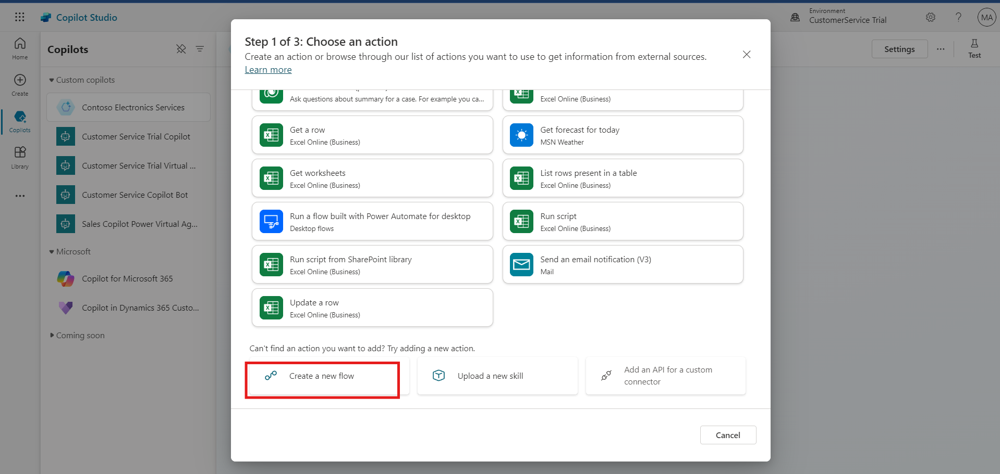

5.  Select **Run a flow** and rename the flow as **Book Appointments
    Flow**.

6.  Select the trigger step "**Run a flow from Copilot,"** and then
    select **+ Add an input**.

7.  Select **Text** for the input type and configure the following
    inputs by repeating the process:

    1.  Enter **Type** in input field for Appointment Type

    2.  Enter **Date** in input field for Appointment Date

    3.  Enter **Email** in input field for Email Address

    4.  Enter **Name** in input field for Full Name

    5.  Enter **Phone** in input field for Phone Number

    6.  Enter **Time** in input field for Appointment Time

>  style="width:6.26806in;height:2.80069in" />
>
>  style="width:6.26806in;height:2.76042in" />
>
>  style="width:6.26806in;height:2.96875in" />

8.  Click on the **+ icon** between the two steps in the flow and select
    **Add an action**.

9.  In the **Search** field, type **Dataverse** and select **See more**
    for the Dataverse connector.

10. Select **Add a new row** action.

11. Login with the same credential for the Oauth Sign.

12. Choose **Book Appointments** for the table name.

13. Select **Show all** to see all available fields.

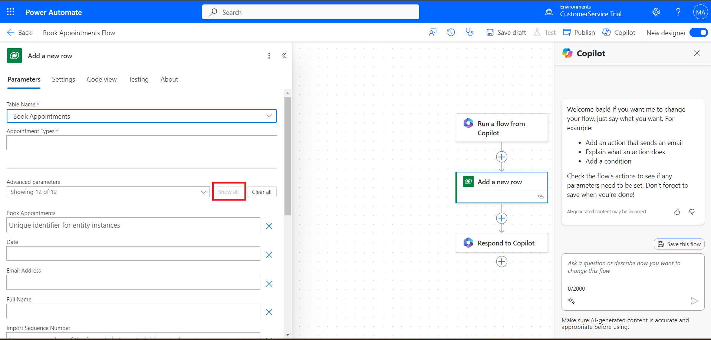

14. Use **Dynamic content** to map each input parameter to the
    corresponding field:

    1.  **Type** Dynamic Input → **Appointment Type** Parameter.

    2.  **Date** Dynamic Input → **Appointment Date** Parameter

    3.  **Email** Dynamic Input → **Email Address** Parameter

    4.  **Name** Dynamic Input → **Full Name** Parameter

    5.  **Phone** Dynamic Input → **Phone Number** Parameter

    6.  **Time** Dynamic Input → **Appointment Time** Parameter

>  style="width:6.26806in;height:2.95903in" />

15. Select **Respond to Copilot** action.

>  style="width:6.26806in;height:2.9625in" />

16. Click on **Settings**.

17. Ensure that **Asynchronous Response** is set to **Off**.

18. Select **Save draft**.

19. Then, click on **Publish**.

>  style="width:6.26806in;height:2.95208in" />

20. Once the flow is published, close the Power Automate tab to return
    to Copilot Studio.

## Task 2: Create Action in Copilot for Book Appointments

1.  Go to copilot window and click on **Refresh**, (If the Copilot
    window was closed, reopen it and navigate back to the **Copilot
    Studio,** go to the **Actions** tab and click on **+ Add an
    action**.)

2.  In the "**Choose an action**" window, select the **Book Appointments
    Flow** you created.

3.  Click on **Next**, **Next** then **Next** again, and finally
    **Finish**. The flow will now be added as an action.

4.  Navigate to the **Topics** section and select the **Book
    Appointments** topic.

5.  Below the Adaptive Card node, click on the **+** sign to create a
    new node.

6.  Select **Call an action**. Choose the **Book Appointments Flow**.
    This action will now be added below the Adaptive Card node.

7.  In the action node, you need to map each input field to the
    appropriate variable created by the Adaptive Card:

    1.  **Type** Input: Click on the input field, then select
        **Appointmenttype** from the custom variables.

    2.  **Date** Input: Click on the input field, then select
        **appointmentDate** from the custom variables.

    3.  **Email** Input: Click on the input field, then select
        **contactEmail** from the custom variables.

    4.  **Name** Input: Click on the input field, then select
        **fullName** from the custom variables.

    5.  **Phone** Input: Click on the input field, then select
        **contactPhone** from the custom variables.

    6.  **Time** Input: Click on the input field, then select
        **appointmenttime** from the custom variables.

>  style="width:6.26806in;height:2.97292in" />

8.  After mapping all the variables, click on the **Save** button to
    save the topic configuration.

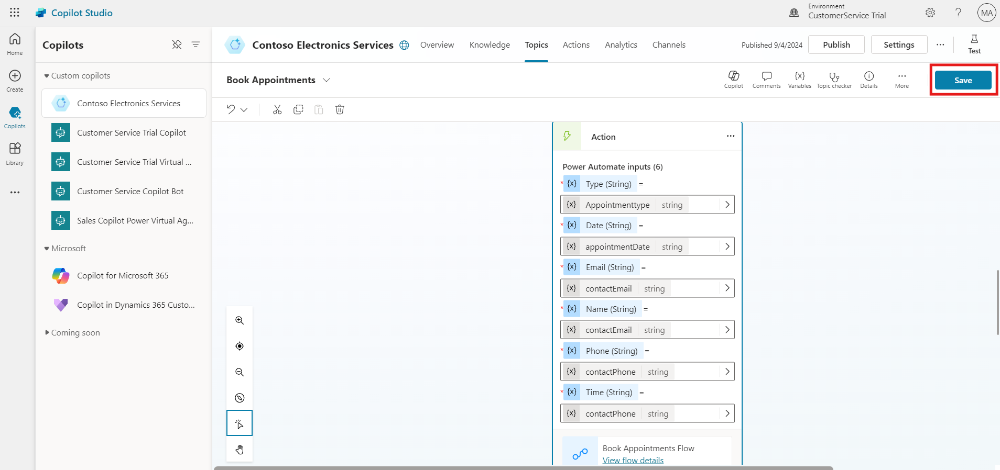

## Task 3: Create Power Automate Flow to Refund Requests Flow

1.  In the Copilot pane on the left-hand side of the screen, click on
    your Copilot to return to the **Overview** tab.

2.  Select the **Actions** tab to start configuring actions for your
    Copilot.

3.  Click on **+ Add an action**.

4.  Scroll down and select **Create a new flow** a new Power Automate
    flow window will pop up. Check the environment from top right
    corner, if correct environment (CustomerService Trial) not selected,
    please select the correct environment.

5.  Select **Run a flow** and rename the flow as **Refund Request
    Flow**.

6.  In the trigger step "**Run a flow from Copilot,"** select **+ Add an
    input**.

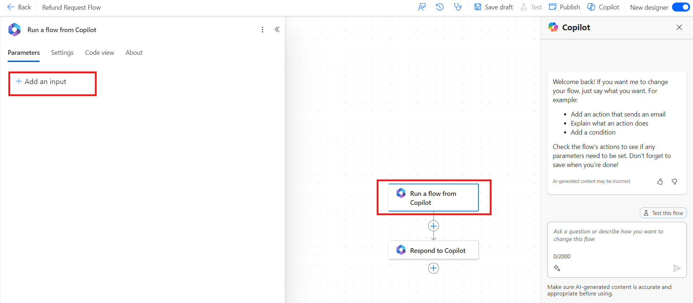

7.  Select **Text** for the input type and configure the following
    inputs by repeating the process:

    1.  Enter **Name** in Input for Full Name

    2.  Enter **Email** in Input for Email

    3.  Enter **Phone Number** in Input for Phone Number

    4.  Enter **Purchase Date** in Input for Date of Purchase

    5.  Enter **Description** in Input for Description

    6.  Enter **Order Number** in Input for Order Number

    7.  Enter **Order Type** in Input for Order Type

    8.  Enter **Product** in Input for Product

    9.  Enter **Receipt Number** in Input for Appointment Type

    10. Enter **Contact Method** in Input for Preferred Contact Method

> 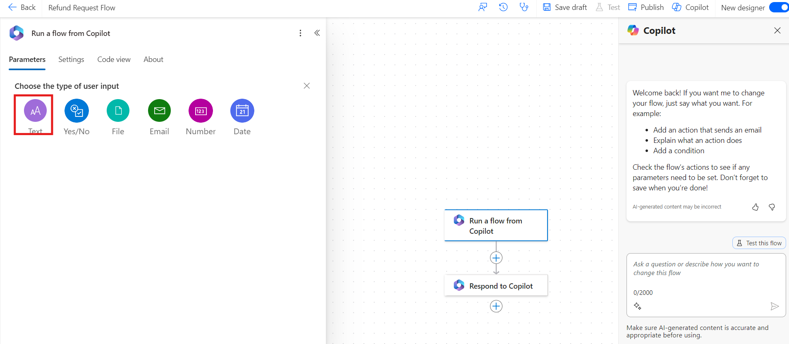 style="width:6.26806in;height:2.73611in" />
>
>  style="width:6.26806in;height:2.73819in" />
>
>  style="width:6.26806in;height:2.75in" />

8.  Click on the **+ icon** between the two steps in the flow and select
    **Add an action**.

9.  In the **Search** field, type **Dataverse** and select **See more**
    for the Dataverse connector.

> 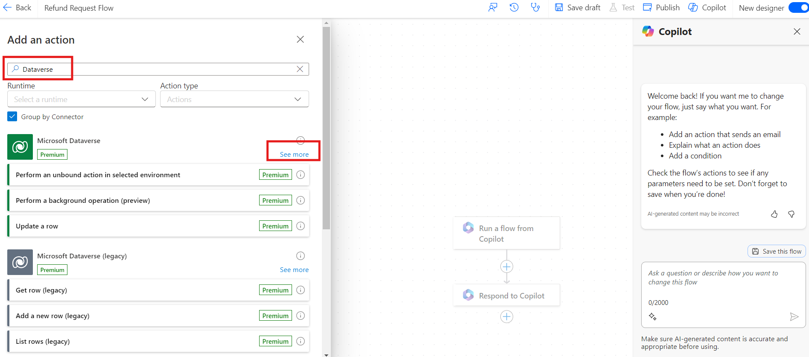 style="width:6.26806in;height:2.76528in" />

10. Select **Add a new row** action.

11. Choose **Refund Requests** for the table name.

12. Select **Show all** to see all available fields.

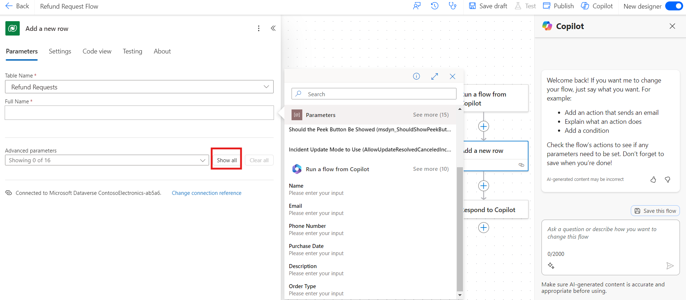

13. Use **Dynamic content** to map each input parameter to the
    corresponding field:

    1.  **Name** Dynamic Input → **Full Name** Parameter.

    2.  **Purchase Date** Dynamic Input → **Date of Purchase**
        Parameter.

    3.  **Description** Dynamic Input → **Description** Parameter.

    4.  **Email** Dynamic Input → **Email** Parameter.

    5.  **Order Number** Dynamic Input → **Order Number** Parameter.

    6.  **Order Type** Dynamic Input → **Order Type** Parameter.

    7.  **Phone Number** Dynamic Input → **Phone Number** Parameter.

    8.  **Product** Dynamic Input → **Product** Parameter.

    9.  **Receipt Number** Dynamic Input → **Receipt Number** Parameter.

    10. **Contact Method** Dynamic Input → **Preferred Contact Method**
        Parameter.

> 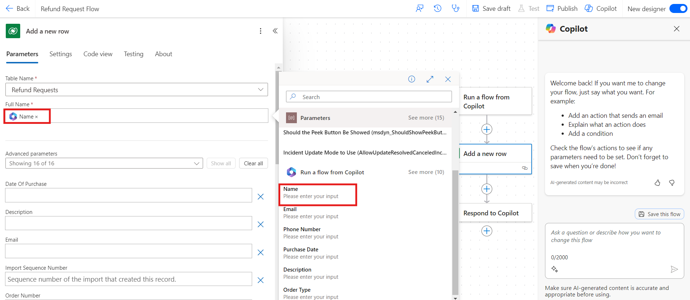 style="width:6.26806in;height:2.72917in" />
>
>  style="width:6.26806in;height:2.78542in" />

14. Select **Respond to Copilot** action.

15. Click on **Settings**.

16. Ensure that **Asynchronous Response** is set to **Off**.

>  style="width:6.26806in;height:2.77361in" />

17. Select **Save draft**.

18. Then, click on **Publish**.

>  style="width:6.26806in;height:2.96319in" />

19. Once the flow is published, close the Power Automate tab to return
    to Copilot Studio.

## Task 4: Create Action in Copilot for Refund Requests

1.  Go to copilot window and click on **Refresh**, (If the Copilot
    window was closed, reopen it and navigate back to the **Copilot
    Studio.** Go to the **Actions** tab and click on **+ Add an
    action**.)

2.  In the "Choose an action" window, select the **Refund Requests
    Flow** you created.

3.  Click on **Next**, **Next** then **Next** again, and finally
    **Finish**. The flow will now be added as an action.

4.  Navigate to the **Topics** section.

5.  Select the **Refund Requests** topic.

6.  Below the Adaptive Card node, click on the **+** sign to create a
    new node.

7.  Select **Call an action**.

8.  Choose the **Refund Requests Flow**. This action will now be added
    below the Adaptive Card node.

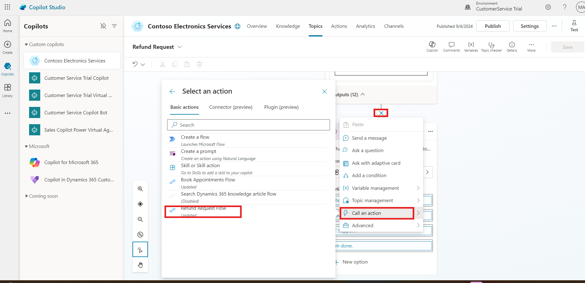

9.  In the action node, you need to map each input field to the
    appropriate variable created by the Adaptive Card:

    1.  **Name** Input: Click on the input field, then select
        **fullname** from the custom variables.

    2.  **Email** Input: Click on the input field, then select **email**
        from the custom variables.

    3.  **Phone Number** Input: Click on the input field, then select
        **phoneNumber** from the custom variables.

    4.  **Product** Input: Click on the input field, then select
        **product** from the custom variables.

    5.  **Contact Method** Input: Click on the input field, then select
        **contactMethod** from the custom variables.

    6.  **Order Type** Input: Click on the input field, then select
        **orderType** from the custom variables.

    7.  **Receipt Number** Input: Click on the input field, then select
        **receiptNumber** from the custom variables.

    8.  **Order Number** Input: Click on the input field, then select
        **orderNumber** from the custom variables.

    9.  **Purchase Date** Input: Click on the input field, then select
        **purchaseDate** from the custom variables.

    10. **Description** Input: Click on the input field, then select
        **description** from the custom variables.

>  style="width:6.26806in;height:2.91528in" />
>
>  style="width:6.26806in;height:2.97708in" />

10. After mapping all the variables, click on the **Save** button to
    save the topic configuration.

## Task 5: Publish Your Copilot

1.  Navigate to Overview section and In Microsoft Copilot Studio, look
    for the **Publish** button on the right side of the screen.

2.  Click on the **Publish** button to start the publishing process.

3.  A confirmation dialog may appear. Select **Publish** again to
    finalize and publish your copilot.

## Conclusion

After completing this exercise, you have gained the following knowledge:

1.  You designed a Power Automate flow to capture appointment details
    and store them in Dataverse. This flow was then integrated into the
    Copilot to enable users to book appointments seamlessly.

2.  You created a separate Power Automate flow for processing refund
    requests. This flow also captured detailed user inputs and recorded
    them in Dataverse, integrating the flow into the Copilot for
    efficient refund management.

These automated workflows enhance the Copilot's functionality, allowing
it to handle appointments and refunds effectively, improving overall
user experience.

# Test Your Copilot

To test the functionalities of your Copilot and Power Automate flows,
follow these steps:

1.  Click on the three-dot right side of the window and select **Go to
    demo website.** A demo website window will open start the
    conversation into the website chat window.

2.  Enter the following trigger phrases for information about the laptop
    and book appointment to test:

<!-- -->

1.  What are some deals on student laptops right now?

2.  Tell me more about Surface Laptop Go 3. What are the specs & cost?

>  style="width:6.26806in;height:2.96389in" />
>
>  style="width:6.26806in;height:2.95208in" />

3.  Compare laptop surface laptop pro 3 and surface laptop studio 2.

>  style="width:6.26806in;height:2.97917in" />
>
>  style="width:6.26806in;height:2.94792in" />

4.  Book Appointment for further assistance

>  style="width:6.26806in;height:2.97361in" />
>
>  style="width:6.26806in;height:2.96736in" />

5.  Ensure that the details entered in the Appointment Booking are
    accurately reflected in the "Book Appointments" table in Power Apps.

>  style="width:6.26806in;height:2.96042in" />

3.  Enter the following trigger phrases to test the topics you created:

    1.  I want to know about the Contoso refund policy.

2.  I buy laptop 10 days ago, is I eligible to return laptop.

3.  I buy laptop 3 day ago; I have to submit refund request.

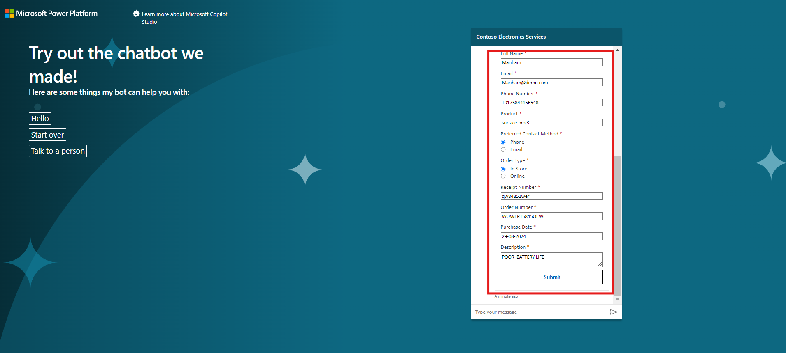

4.  Ensure that the details entered in the Appointment Booking are
    accurately reflected in the "Refund Requests" table in Power Apps.

# Final Conclusion

In conclusion, the steps taken in setting up Dynamics 365 Customer
Service, enrolling in Microsoft Power Apps and Copilot Studio, and
creating custom tables have established a solid foundation for effective
and streamlined operations.

1.  **Dynamics 365 Customer Service Setup:** We signed up for a trial,
    managed users, and configured essential settings, laying the
    foundation for optimized customer service operations.

2.  **Microsoft Power Apps and Copilot Studio Enrolment:** We signed up
    for both platforms, setting up our accounts and environments to
    start building and integrating automated solutions.

3.  **Custom Table Creation in Power Apps:** We created and configured
    custom tables—"Book Appointments" and "Refund Requests"—to manage
    and organize data effectively, ensuring that all necessary
    information is captured.

4.  **Copilot Configuration in Microsoft Copilot Studio:** We set up a
    new copilot for Contoso Electronics, including naming it,
    configuring security settings, enabling AI features, cleaning up
    sample topics, creating a knowledge base, and publishing it for
    operational use.

5.  **Topic Management in Copilot Studio:** We developed various topics
    to handle customer inquiries, such as "Product Information," "Return
    Policy Information," and others. We also fine-tuned settings for
    effective customer interaction.

6.  **Integration of Power Automate Flows:** We created and integrated
    Power Automate flows to automate key processes like booking
    appointments and handling refund requests, enhancing our copilot’s
    functionality and user experience.
